# Madcamp Lounge

> 몰입캠프 참가자들만을 위한 소셜 앱. 분반 사이의 벽을 없애고 모두 친해져 봐요~

KAIST MadCamp 2025 Winter · Week 1
개발 기간: 2026.01.08 ~ 2026.01.14

---

## 🧑‍💻 팀원 소개 (Team Members)

| 이름 (Name) | 역할 (Role) |  학교/학과 (Affiliation)   | GitHub |
  |:---:|:---:|:----------------------:|:---:|
| 박정우 | Backend Developer | 한양대학교<br>컴퓨터소프트웨어학부 21 | @keper1212 (https://github.com/keper1212) |
| 홍우주 | Frontend Developer |    KAIST<br>전산학부 24    | @widewoods (https://github.com/widewoods) |

---

## 💡 프로젝트 소개 (Project Introduction)

몰캠 라운지는 몰입캠프 참가자들이 파티를 만들고 참여하며 자연스럽게 친해질 수 있도록 설계된 소셜 플랫폼입니다.
파티 모집 → 참가 → 채팅이 하나의 흐름으로 이어지며, 1:1 채팅과 파티 추천 기능까지 지원합니다.

### 기획 의도

몰입캠프는 4분반, 각 분반 20명 총 80명 규모로 구성되어 있어요. 같은 분반 안에서는 자연스럽게 친해지지만, 다른 분반 사람들과는 교류할 기회가 거의 없습니다. 
이러한 문제를 해결하기 위해 다른 분반 사람들과도 쉽게 교류할 수 있는 플랫폼을 만들었습니다. 이제 인원이 없어서 풋살, 농구 혹은 롤 내전 같이 많은 사람이 못하는 일은 없을겁니다.

---

## 🛠️ 기술 스택 (Tech Stack)

### 🎨 Frontend (Flutter)

| 구분 | 상세 내용 (Details) |
  | :---: | :--- |
| Language |  |
| Framework |  |
| State / Network |   |
| Realtime |  |
| Security |  |
  <br>

### ☁️ Backend

| 구분 | 상세 내용 (Details) |
  | :---: | :--- |
| Framework |  |
| Language |  |
| Auth |  |
| Realtime |  |
  <br>

### 🗄️ Database & Infra

| 구분 | 상세 내용 (Details) |
  | :---: | :--- |
| Database |  |
| Hosting |  |
  <br>

### 📍 External APIs

| 구분 | 상세 내용 (Details) |
  | :---: | :--- |
| Map / Search |  
|
  <br>

### 📦 Data Pipeline

| 구분 | 상세 내용 (Details) |
  | :---: | :--- |
| User Seed | Notion → CSV 추출 → 데이터 정제 → PostgreSQL(users 테이블 반영) |
  <br>

### 🧰 Version Control

| 구분 | 상세 내용 (Details) |
  | :---: | :--- |
| VCS |   |

---

## 🏛️ 시스템 아키텍처


---

## 🗂️ 데이터베이스

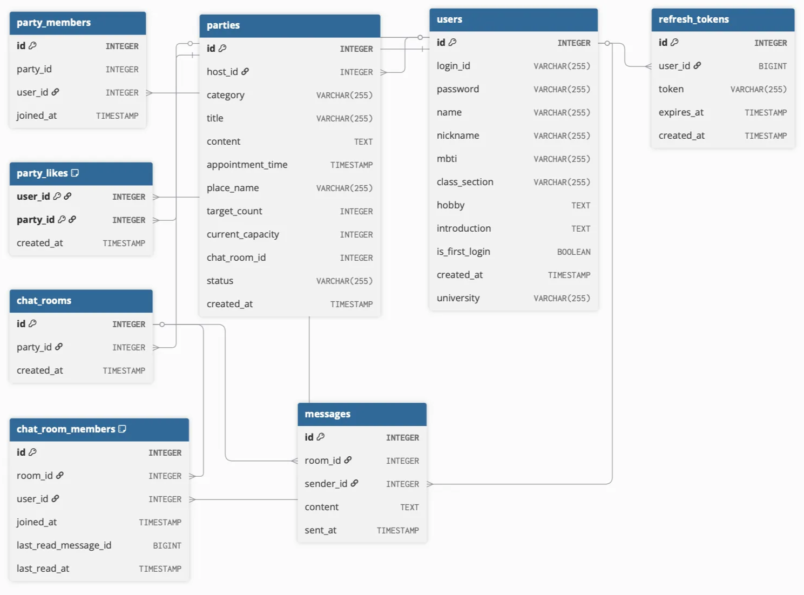

---

## 📡 주요 엔드포인트 (High-Level)

### /auth

로그인/로그아웃/토큰 재발급/비밀번호 변경 등 인증 관련 기능을 담당합니다.
JWT 기반 인증을 사용하며, Access/Refresh 토큰을 발급합니다.

### /profile

내 프로필 및 상대 프로필을 조회하고 수정하는 프로필 관리 기능을 담당합니다.
닉네임, 취미, 자기소개 수정 및 최초 로그인 비밀번호 변경 흐름과 연결됩니다.

### /party

파티 생성, 수정, 조회, 참가/탈퇴, 종료 등 파티 매칭 기능의 중심 엔드포인트입니다.
파티 생성 시 채팅방이 자동 생성되고, 참가 시 자동 참여됩니다.

### /chat

채팅방 목록, 채팅방 상세, 1:1 채팅 생성 등 채팅 관련 기능을 제공합니다.
메시지 내역 로딩 및 unread_count 계산도 포함됩니다.

### WebSocket (/app, /topic)

실시간 채팅 송수신 및 읽음 처리를 담당합니다.

- /app/rooms/{roomId}: 메시지 전송
- /topic/rooms/{roomId}: 메시지 수신
- /app/rooms/{roomId}/read: 읽음 처리
- /topic/rooms/{roomId}/read: 읽음 브로드캐스트

---

<br>

## 📱 주요 기능 (Key Features)

| 1. 로그인 | 2. 파티 | 3. 놀거리 추천 | 4. 채팅 | 5. 프로필 |
  |:--:|:--:|:--:|:--:|:--:|
| **로그인 기능**<br>이미 만들어둔 각자의 계정으로 로그인<br>첫 로그인시 프로필 탭으로 이동 후 비밀번호 변경 권장 dialog 출력 | **파티 생성 & 참여**<br>파티를 생성하고 참여하기를 눌러 파티 및 채팅방 가입 | **놀거리 카테고리
  분류 & 추천**<br>현 위치에서 가장 가까운 5개의 가게 추천 | **채팅 기능**<br>채팅방 리스트 출력<br>개인 채팅, 단체 채팅 모두 지원 | **프로필 정보 확인**<br>프로필 수정 가능 |
| 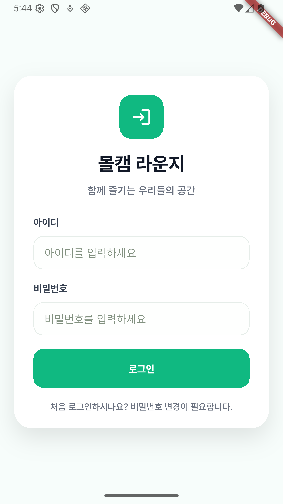 | 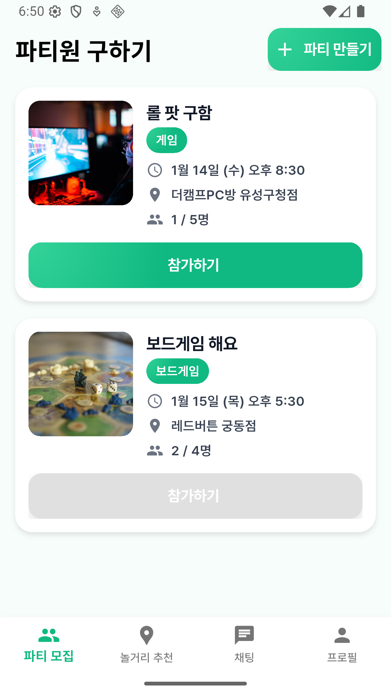 |  | 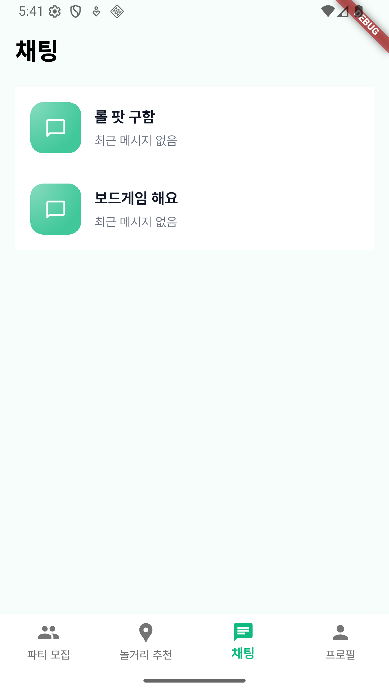 | 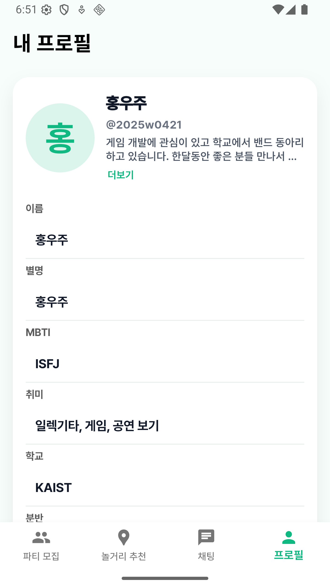 |
| 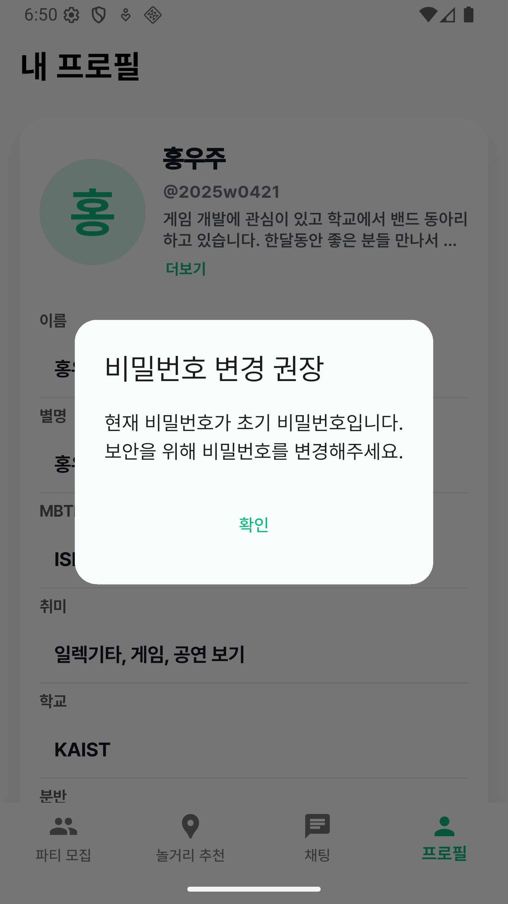 | 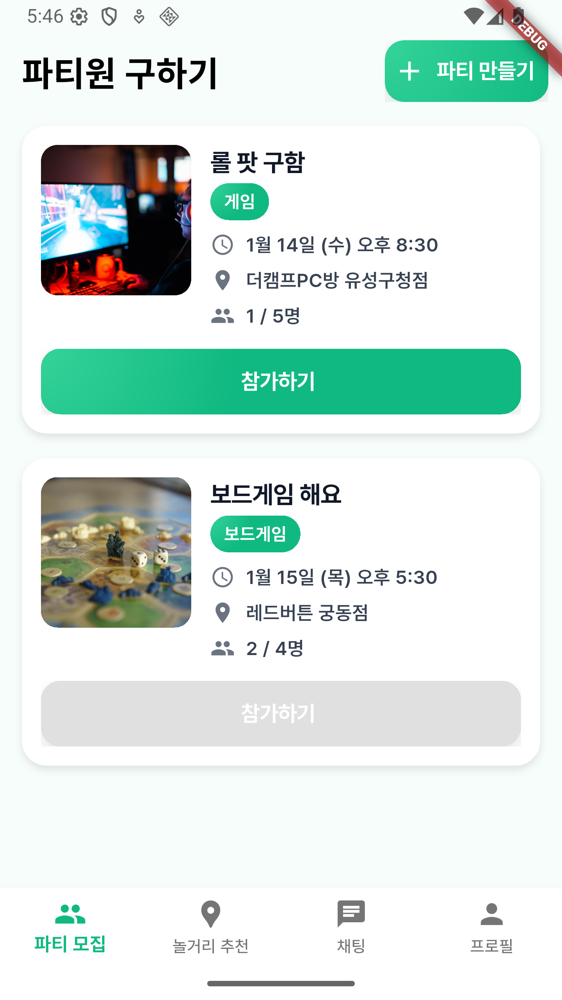 | 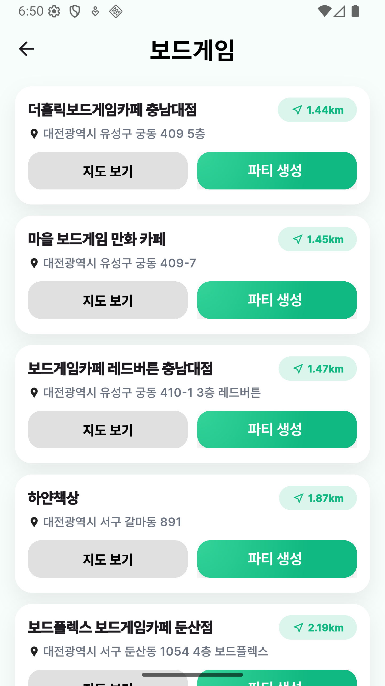 | 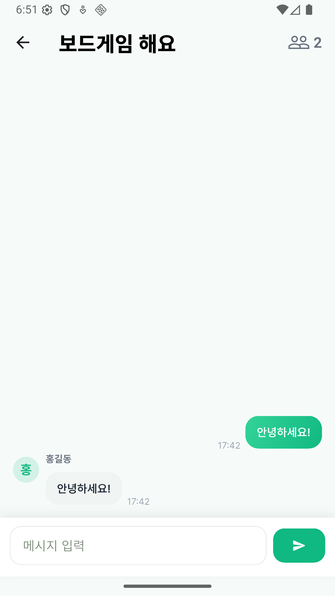 | 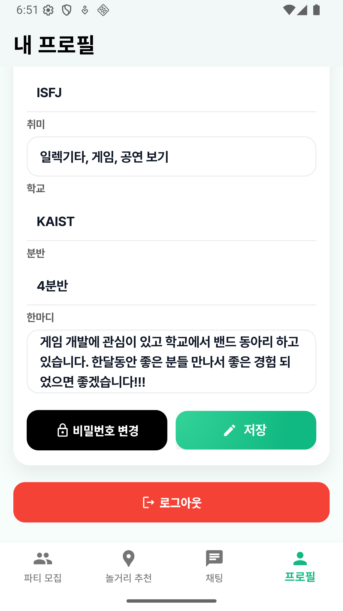 |
|  | 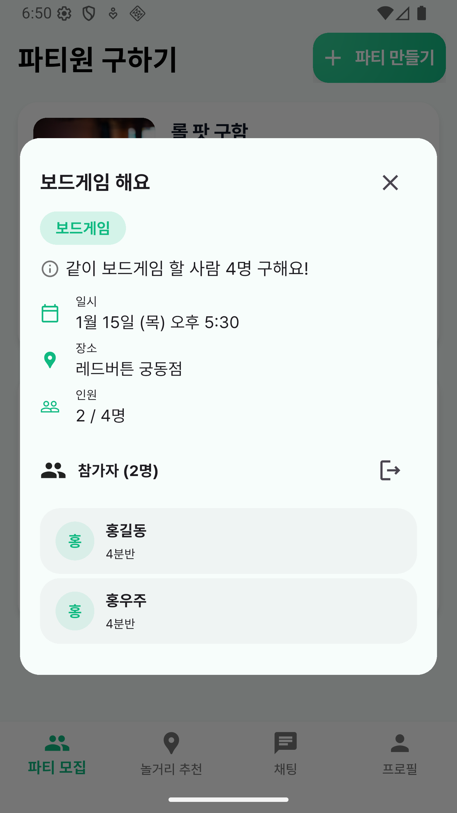 | 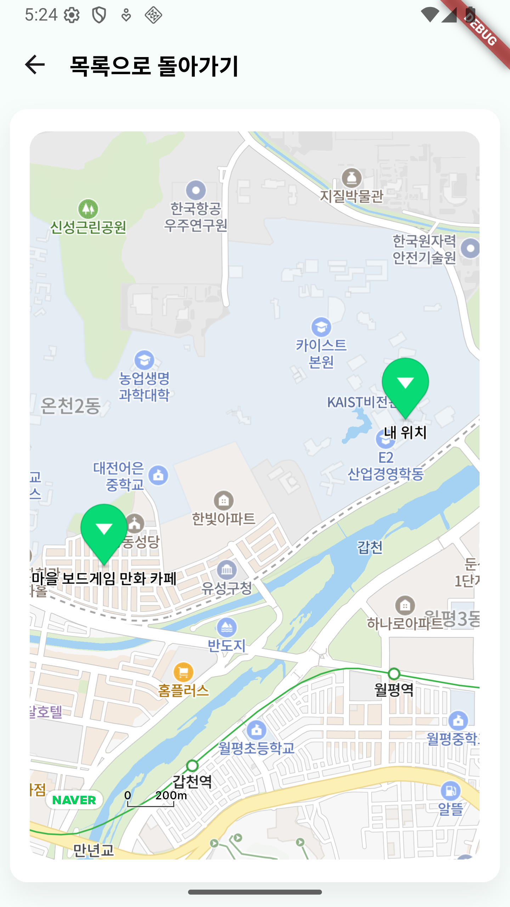 |  |  |

<br>

## 🚀 로컬 실행 방법

### 1. DB 생성 (PostgreSQL)

1. PostgreSQL 접속
2. 
```
psql -U postgres
```

2. DB 생성

```
CREATE DATABASE madcamp_lounge;
```

3. 사용자 생성 (선택)

```
CREATE USER users WITH PASSWORD 'passward';
GRANT ALL PRIVILEGES ON DATABASE madcamp_lounge TO users;
```

---

### 2. 환경 설정 (application-local.properties)

```
src/main/resources/application-local.properties에 DB/JWT 설정 추가:

spring.application.name=madcamp_lounge

spring.datasource.url=jdbc:postgresql://localhost:5432/madcamp_lounge
spring.datasource.username=users
spring.datasource.password=passward
spring.datasource.driver-class-name=org.postgresql.Driver

spring.jpa.show-sql=true
spring.jpa.properties.hibernate.format_sql=true

jwt.secret=madcamp-lounge-dev-secret-key-please-change
jwt.access-token-minutes=30
jwt.refresh-token-days=14
```

---

### 3. Backend 실행

```
./gradlew bootRun
```

---

### 4. Frontend 실행 (Flutter)

flutter pub get
flutter run


---
